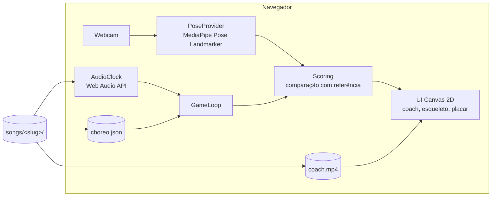

# 02. Arquitetura

## Decisão: aplicação web estática

O jogo é uma aplicação web estática. Motivos: roda em qualquer notebook com Chrome ou
Edge sem instalação, a detecção de pose no navegador (MediaPipe via WebAssembly e
WebGL) já é rápida o bastante para 30 fps, o deploy é um `git push` (Vercel ou
GitHub Pages) e não há backend para operar no MVP.

Alternativas consideradas e por que não agora:

| Opção | Prós | Contras |
| --- | --- | --- |
| Godot 4 + plugin MediaPipe | Motor de jogo completo, exporta para desktop | Integração de pose menos madura, exige instalação pelo usuário |
| Unity + Sentis | Ferramentas de animação e avatar 3D | Licença, peso do build, curva de aprendizado |
| App nativo Android/iOS | Câmera nativa | Câmera frontal em pé enquadra mal o corpo inteiro; distribuição em loja |

## Componentes



### PoseProvider

Interface única para a detecção de pose, para trocar de modelo sem mexer no jogo.

```ts
interface PoseFrame {
  t: number;                 // ms no relógio do áudio
  landmarks: Landmark[];     // 33 pontos normalizados (0..1) para desenhar
  world: Landmark[];         // 33 pontos em metros, origem no quadril, para pontuar
}
interface PoseProvider {
  init(opts: { modelo: "lite" | "full"; delegate: "GPU" | "CPU" }): Promise<void>;
  detect(video: HTMLVideoElement, tMs: number): PoseFrame | null;
}
```

Implementação padrão: `@mediapipe/tasks-vision` (`PoseLandmarker`, modo VIDEO,
delegate GPU com fallback para CPU). Alternativa mapeada: TensorFlow.js MoveNet
Lightning (17 pontos, mais leve, sem coordenadas 3D).

### AudioClock

`AudioContext.currentTime` é a fonte de verdade do tempo de jogo. A música é
tocada com `AudioBufferSourceNode` agendado em um instante conhecido, então
`tMs = (ctx.currentTime - inicio) * 1000` é exato e não deriva. O vídeo do coach é
sincronizado a esse relógio (ajuste de `currentTime` quando a diferença passa de
60 ms).

### GameLoop

`requestAnimationFrame`. A cada frame:

1. Lê `tMs` do AudioClock.
2. Se o vídeo da webcam tem frame novo, chama `PoseProvider.detect`.
3. Guarda o `PoseFrame` num buffer circular dos últimos 2 segundos.
4. Ao cruzar o fim de um movimento da coreografia, chama `Scoring.avaliar`.
5. Desenha coach, esqueleto do jogador, faixa de movimentos e placar.

### Scoring

Recebe o trecho da referência e o buffer de poses do jogador e devolve nota,
classe e detalhes por membro. A fórmula está em `04-movimentos-e-pontuacao.md`.

### Dados

Uma pasta por música em `songs/<slug>/` com `song.json`, `choreo.json`,
`audio.mp3` (ou `.ogg`) e `coach.mp4`. Formatos em `05-formatos-de-dados.md`.
Um `songs/index.json` lista o catálogo.

## Estrutura de código proposta

```
src/
  pose/        PoseProvider, implementação MediaPipe, utilitários de landmarks
  audio/       AudioClock, carregamento e decodificação de áudio
  game/        GameLoop, estado, máquina de telas (menu, calibração, jogo, resultado)
  scoring/     normalização, vetores de membros, similaridade, classes, estrelas
  ui/          desenho em Canvas 2D, faixa de movimentos, placar, telas
  data/        tipos, carregamento de song.json e choreo.json, validação
tools/
  extrair-coreografia/   página que roda o modelo num vídeo e baixa o choreo.json
  marcar-movimentos/     página para marcar início e fim dos movimentos sobre o vídeo
songs/
  <slug>/      song.json, choreo.json, audio, coach
```

## Ferramentas de produção de coreografia

Rodam no navegador com o mesmo modelo do jogo, o que garante que a referência e a
leitura do jogador falem a mesma língua.

- **extrair-coreografia**: carrega `coach.mp4`, percorre o vídeo frame a frame
  (`video.currentTime` em passos de 1/30 s, aguardando `seeked`), roda
  `detectForVideo`, e baixa `choreo.json` com os 33 pontos por frame.
- **marcar-movimentos**: toca o vídeo, mostra a grade de tempos a partir do BPM e
  permite marcar início, fim, nome e peso de cada movimento; salva no mesmo
  `choreo.json`.

Extração em lote (muitas músicas) pode ser feita em Python com o pacote
`mediapipe`, que expõe o mesmo Pose Landmarker.

## Deploy

Build do Vite gera `dist/`. Deploy estático (Vercel ou GitHub Pages). Os arquivos de
mídia ficam no próprio repositório enquanto o catálogo for pequeno; quando passar de
algumas dezenas de MB, mover para Git LFS ou storage externo com CDN.

## Requisitos de desempenho

| Item | Alvo |
| --- | --- |
| Detecção | 25 a 30 fps com modelo `lite` e GPU; 12 a 15 fps com CPU |
| Latência câmera até pontuação | menor que 150 ms (sem contar a reação humana) |
| Resolução da webcam | 640x480 (o modelo redimensiona internamente) |
| Tamanho da página inicial | menor que 5 MB sem contar músicas |
